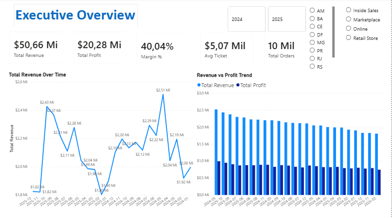
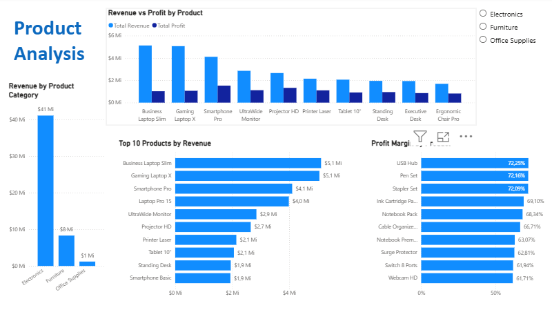
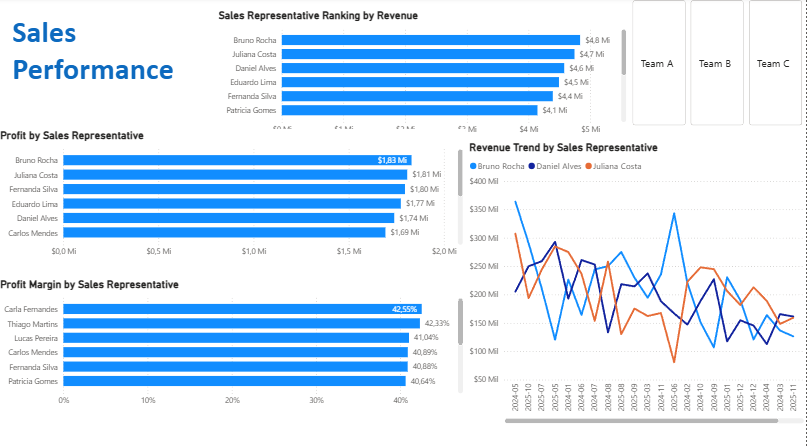
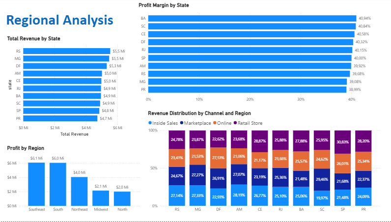
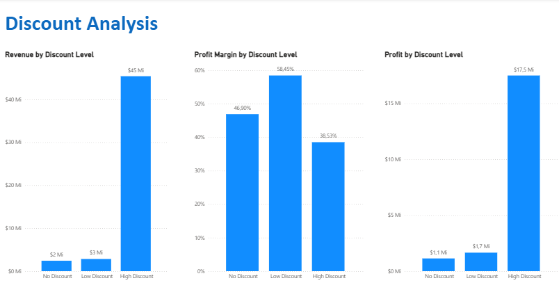
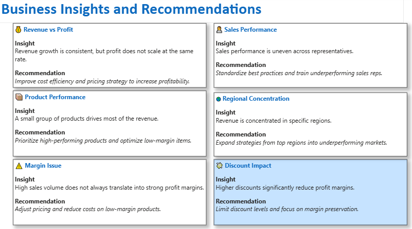

# Sales Performance Analytics | SQL Server + Power BI

**End-to-end sales analytics project focused on revenue, profitability, commercial performance, and discount impact.**

---

## Overview

This project simulates a real-world sales environment and analyzes business performance using SQL Server and Power BI.

The goal is to transform structured data into actionable insights that support decision-making.

---

## Business Problem

The business needs to understand:

- What drives revenue and profit
- Which products are truly profitable
- How sales performance varies across representatives
- Which regions and channels perform best
- How discount strategies impact profitability

---

## Tech Stack

- SQL Server
- Power BI
- DAX

---

## Data Model

The project uses a **star schema** with one fact table and multiple dimensions:

- `fact_sales`
- `dim_date`
- `dim_customers`
- `dim_products`
- `dim_sales_reps`
- `dim_regions`
- `dim_channels`

---

## Dashboard

### Executive Overview

### Product Analysis

### Sales Performance

### Regional Analysis

### Discount Analysis

### Business Insights & Recommendations

---

## Key Insights

- Revenue is strong, but profit growth is limited by margin inefficiencies  
- Sales are concentrated in a small group of products  
- High sales volume does not always generate strong margins  
- Sales performance varies across representatives  
- Revenue is concentrated in specific regions  
- Higher discounts significantly reduce profitability  

---

## Strategic Recommendations

- Improve pricing and cost efficiency  
- Prioritize high-performing products  
- Replicate best sales practices  
- Expand strategies to weaker regions  
- Reduce excessive discounting  

---

## What This Project Demonstrates

- Data modeling using star schema  
- SQL-based data generation and analysis  
- Business-oriented KPI development  
- Power BI dashboard design  
- Analytical thinking focused on decision-making  

---

## Author

**Daniel de Melo Martins**
